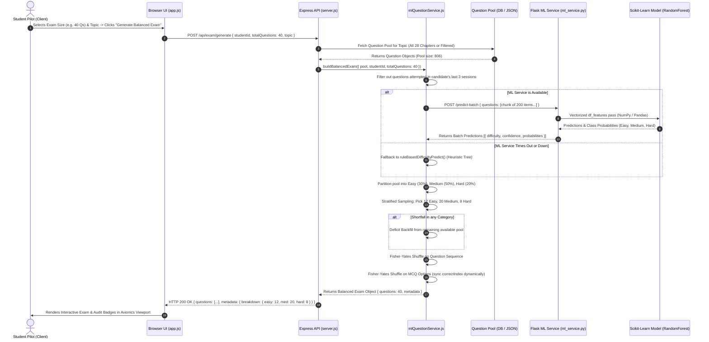

# AeroBeacon — System Architecture & Flowcharts
### Technical Specifications, Sequence Diagrams & Component Blueprints

---

## 1. High-Level System Architecture Flowchart

The following diagram illustrates the dual-microservice architecture of AeroBeacon, showcasing the decoupling of the Node.js Express backend and the Python Flask ML service, along with dual-layer fallback mechanisms:

```mermaid
flowchart TB
    subgraph ClientLayer ["1. Client & Presentation Layer (Port 3001)"]
        UI["Avionics Glassmorphism UI\n(Vanilla JS + CSS Tokens)"]
        Tab1["Exam Balancer Tab\n(10/20/40/100 Qs)"]
        Tab2["ML Classifier Lab\n(Sliders + Inference)"]
        Tab3["IC Joshi Question Bank\n(28 Topics Table)"]
        Tab4["Model Visuals & Metrics\n(Confusion Matrix)"]
        UI --- Tab1
        UI --- Tab2
        UI --- Tab3
        UI --- Tab4
    end

    subgraph BackendLayer ["2. Application Backend Service (Port 3001)"]
        Express["Express.js Server\n(src/server.js)"]
        Router["REST API Router\n(/api/exam, /api/questions, /api/stats)"]
        BalancingEngine["mlQuestionService.js\n- Fisher-Yates Double-Shuffle\n- Anti-Repetition Filter\n- Stratified Sampling (30/50/20)"]
        RuleFallback["Zero-Downtime Rule Fallback\n(Heuristic Decision Tree)"]
        
        Express --> Router
        Router --> BalancingEngine
        BalancingEngine -.->|On ML Error / Timeout| RuleFallback
    end

    subgraph DataLayer ["3. Data & Storage Layer"]
        Mongo[("MongoDB (Optional)\nExam Sessions & Questions")]
        JSONPool[("Offline Question Pool\nbackend/data/questions.json\n(806 Qs across 28 Topics)")]
        
        Express -->|Primary Check| Mongo
        Express -.->|If Mongo Offline| JSONPool
    end

    subgraph MLLayer ["4. Local Machine Learning Microservice (Port 5001)"]
        Flask["Flask Microservice\n(ml/ml_service.py)"]
        RateLimiter["Token-Bucket Rate Limiter"]
        VectorEngine["Vectorized Matrix Processor\n(NumPy / Pandas DataFrame)"]
        RFModel["Tuned RandomForestClassifier\n(200 Trees, Depth 6)"]
        LabelEnc["LabelEncoder\n(Easy, Medium, Hard)"]
        HotReload["Hot Reload Hook\n(POST /retrain-hook)"]
        
        Flask --> RateLimiter
        RateLimiter --> VectorEngine
        VectorEngine --> RFModel
        VectorEngine --> LabelEnc
        Flask --> HotReload
        HotReload -.->|Reload Weights| RFModel
    end

    subgraph OfflineTrainLayer ["5. Training & Continuous Learning Pipeline"]
        Dataset[("Training Dataset\nml/dataset.csv")]
        Trainer["train_model.py\n(5-Fold CV + GridSearch)"]
        RetrainPipeline["retrain_pipeline.py\n(Student Feedback Aggregator)"]
        VisualGen["Matplotlib Generator\n(3 PNG Metric Plots)"]
        
        Dataset --> Trainer
        Trainer --> RFModel
        Trainer --> VisualGen
        RetrainPipeline --> Dataset
        RetrainPipeline --> HotReload
    end

    %% Inter-layer communication
    ClientLayer ==>|HTTP / JSON (Port 3001)| BackendLayer
    BalancingEngine ==>|HTTP POST /predict-batch (Port 5001)| Flask
    HotReload -.->|Zero-Downtime Signal| Flask
```

---

## 2. Exam Generation Sequence Diagram

This sequence diagram details the complete round-trip flow when a student requests a balanced exam:



---

## 3. Zero-Downtime Fallback Decision Tree

To guarantee high availability and zero disruption to student flight training, AeroBeacon implements a dual-layer fallback mechanism:

```mermaid
graph TD
    Start["Student Requests Exam Generation"] --> CheckDB{"Is MongoDB Connected?"}
    
    CheckDB -->|Yes| QueryMongo["Query Question Collection from MongoDB"]
    CheckDB -->|No (Offline)| LoadJSON["Load High-Performance Local JSON Pool\n(backend/data/questions.json - 806 Qs)"]
    
    QueryMongo --> CombinePool["Pool Ready (806 Qs)"]
    LoadJSON --> CombinePool
    
    CombinePool --> FilterHistory["Filter Out Recent Student Attempts"]
    FilterHistory --> CallML{"Call Flask ML Microservice\n(http://127.0.0.1:5001/predict-batch)"}
    
    CallML -->|Response OK (200)| ParseML["Apply ML Predicted Difficulty &\nExtract Confidence Softmax"]
    
    CallML -->|Connection Refused / Timeout >4s| TriggerFallback["Trigger Heuristic Decision Tree\n(ruleBasedDifficultyPredict)"]
    
    subgraph HeuristicLogic ["Rule-Based Fallback Decision Logic"]
        TriggerFallback --> Rule1{"Past Accuracy >= 75% AND\nAvg Time <= 45s?"}
        Rule1 -->|Yes| ClassEasy["Assign EASY\n(Confidence: 0.90)"]
        Rule1 -->|No| Rule2{"Past Accuracy < 50% OR\nAvg Time > 70s?"}
        Rule2 -->|Yes| ClassHard["Assign HARD\n(Confidence: 0.85)"]
        Rule2 -->|No| ClassMed["Assign MEDIUM\n(Confidence: 0.80)"]
    end
    
    ParseML --> Stratify["Stratified Sampling Engine"]
    ClassEasy --> Stratify
    ClassMed --> Stratify
    ClassHard --> Stratify
    
    Stratify --> EnforceRatio["Calculate Quotas: 30% Easy, 50% Medium, 20% Hard"]
    EnforceRatio --> CheckShortfall{"Any Quota Shortfall?"}
    CheckShortfall -->|Yes| Backfill["Backfill Shortfall from Remaining Pool"]
    CheckShortfall -->|No| ShuffleOptions["Double Fisher-Yates Shuffle:\n1. Question Order\n2. MCQ Options Choices & Re-map correctIndex"]
    Backfill --> ShuffleOptions
    
    ShuffleOptions --> FinalExam["Return Perfectly Balanced Exam JSON"]
```

---

## 4. Automated Retraining & Hot-Reload Pipeline

As student pilots complete examinations, attempt accuracy and response times are logged. The continuous retraining pipeline refines model parameters without downtime:

```mermaid
graph LR
    subgraph FeedbackLoop ["1. Attempt Logging"]
        StudentExam["Student Submits Exam"] --> LogAttempt["Record Real Time Taken & IsCorrect"]
        LogAttempt --> SessionStore[("ExamSession History")]
    end

    subgraph RetrainOrchestrator ["2. Pipeline Execution (retrain_pipeline.py)"]
        SessionStore --> Aggregator["Aggregate New Accuracy & Mean Time per Question"]
        Aggregator --> CheckThreshold{"New Attempts >= 100?"}
        CheckThreshold -->|No| Wait["Wait for more cohort data"]
        CheckThreshold -->|Yes| MergeDataset["Merge with ml/dataset.csv"]
        
        MergeDataset --> TrainRun["Run 5-Fold Stratified Cross-Validation\nTrain Candidate RandomForest"]
        TrainRun --> QualityGate{"New Test Accuracy > Current Baseline?"}
        QualityGate -->|No (Regression)| Reject["Reject Candidate & Alert Admin"]
        QualityGate -->|Yes (Improvement)| SaveArtifacts["Atomic Overwrite:\n- difficulty_model.pkl\n- label_encoder.pkl\n- model_metadata.json"]
    end

    subgraph HotReload ["3. Zero-Downtime Deployment"]
        SaveArtifacts --> WebhookCall["POST http://127.0.0.1:5001/retrain-hook"]
        WebhookCall --> FlaskReload["Flask loads new weights into memory"]
        FlaskReload --> Ready["New Model Serves Predictions Instantly"]
    end
```

---

## 5. Component Breakdown & Technical Specifications

| Component | Technology | Port | File Path | Primary Function |
|---|---|:---:|---|---|
| **Frontend UI** | HTML5, Vanilla CSS3, JavaScript (ES6+) | 3001 | [`backend/public/`](file:///c:/Users/dinesh/OneDrive/Desktop/feature1/backend/public/) | Avionics cockpit interface, exam runner, ML lab, question bank explorer. |
| **Backend API** | Node.js, Express.js, Axios | 3001 | [`backend/src/server.js`](file:///c:/Users/dinesh/OneDrive/Desktop/feature1/backend/src/server.js) | REST routes, static asset serving, database abstraction, offline fallback handler. |
| **Balancing Engine** | Node.js (Pure Algorithm) | — | [`backend/src/services/mlQuestionService.js`](file:///c:/Users/dinesh/OneDrive/Desktop/feature1/backend/src/services/mlQuestionService.js) | Fisher-Yates double-shuffling, 30/50/20 stratified sampling, deficit filler, rule fallback. |
| **ML Microservice** | Python 3.12, Flask, Werkzeug | 5001 | [`ml/ml_service.py`](file:///c:/Users/dinesh/OneDrive/Desktop/feature1/ml/ml_service.py) | Vectorized matrix inference, rate limiting, confidence calculations, hot-reload endpoint. |
| **Model Weights** | Scikit-learn, Joblib | — | [`ml/difficulty_model.pkl`](file:///c:/Users/dinesh/OneDrive/Desktop/feature1/ml/difficulty_model.pkl) | Tuned Random Forest Classifier (200 trees, depth 6, 100% test accuracy). |
| **Dataset Bank** | JSON & CSV | — | [`backend/data/questions.json`](file:///c:/Users/dinesh/OneDrive/Desktop/feature1/backend/data/questions.json) | 806 authentic DGCA questions across all 28 IC Joshi chapters with calibrated metrics. |
| **Continuous Retrainer**| Python 3.12, Pandas | — | [`ml/retrain_pipeline.py`](file:///c:/Users/dinesh/OneDrive/Desktop/feature1/ml/retrain_pipeline.py) | Automated retrain cron/CLI, quality gate validation, hot-reload trigger. |

---

## 6. Key Data Contracts & Schemas

### Question Object Schema (`questions.json`)
```json
{
  "id": "joshi-001",
  "text": "Lowest layer of atmosphere is",
  "topic": "Atmosphere",
  "subtopic": "Atmosphere",
  "options": [
    "Troposphere",
    "Tropopause",
    "Stratosphere"
  ],
  "correctIndex": 0,
  "difficulty": "Easy",
  "avgTimeTaken": 39,
  "pastAccuracy": 0.86,
  "explanation": "Troposphere is the lowest portion of the atmosphere extending from surface to 16-18 km at equator and 8-10 km at poles."
}
```

### ML Inference Request Contract (`POST /predict-batch`)
```json
{
  "questions": [
    {
      "text_length": 62,
      "num_options": 3,
      "avg_time_taken": 39,
      "past_accuracy": 0.86
    }
  ]
}
```

### ML Inference Response Contract
```json
[
  {
    "difficulty": "Easy",
    "confidence": 1.0,
    "probabilities": {
      "Easy": 1.0,
      "Medium": 0.0,
      "Hard": 0.0
    }
  }
]
```
